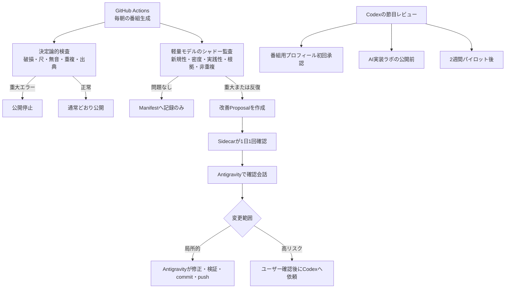
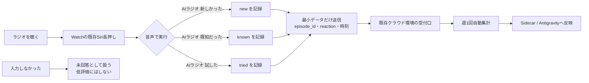

# 放送監査・改善・フィードバック導線

最終更新: 2026-07-14  
状態: 設計案（Phase 7以降のGO前）

## この図で判断すること

- Codexを毎日の放送監査へ常駐させるか
- 日常運用と高リスク変更を、誰が担当するか
- Apple Watchの文字盤を占有せず、番組への反応をどう残すか

## 1. 放送監査と改善の流れ

Codexは毎回の監査には入らない。日々の放送は、決定論的検査、軽量モデル、Sidecar、Antigravityで完結させる。Codexが入るのは、公開・個人情報境界、Workflow・権限・Secrets・依存関係などの高リスク変更と、上図の節目レビューだけとする。

軽い品質低下は1回で通知せずManifestに記録する。同じ問題が直近3回中2回以上続いた場合にだけProposal化し、通知疲れを防ぐ。

## 2. Apple Watchからの低負荷フィードバック

### 入力方針

- Watch文字盤にはComplicationやボタンを追加しない。
- Siriから名前の異なる3つのショートカットを直接実行し、メニュー操作も省略する。
- `新しかった` と `既知だった` は当日の最新エピソードへ自動対応させる。
- `試した` は、直近で `新しかった` と記録した項目へ対応させる。対応候補がない場合だけ、直近の回を確認する。
- メール、自由記述、毎日の回答要求は設けない。
- 運転中や診療中の操作は求めず、安全なタイミングで任意入力する。

### 評価指標の扱い

- 「知らなかった 週3回」は `new` の明示入力数で集計する。
- 「実際に試した 週1回」は `tried` の明示入力数で集計する。
- 無入力は「既に知っていた」「役に立たなかった」と推定しない。
- 2週間パイロットでは厳格なKPIではなく、入力導線と番組価値を確認する観察指標として使う。

