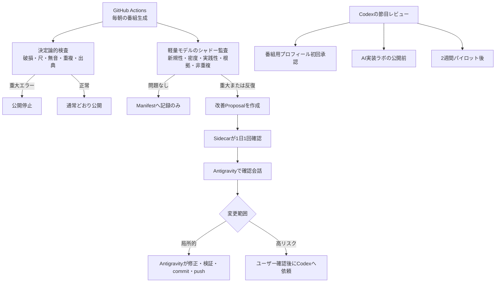
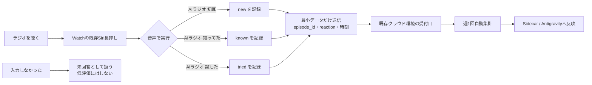

# 放送監査・改善・フィードバック導線

最終更新: 2026-07-15
状態: Siri固定名3本は承認済み・受付APIとショートカット本体は未実装

## この図で判断すること

- Codexを毎日の放送監査へ常駐させるか
- 日常運用と高リスク変更を、誰が担当するか
- Apple Watchの文字盤を占有せず、番組への反応をどう残すか

## 1. 放送監査と改善の流れ

Codexは毎回の監査には入らない。日々の放送は、決定論的検査、軽量モデル、Sidecar、Antigravityで完結させる。Codexが入るのは、公開・個人情報境界、Workflow・権限・Secrets・依存関係などの高リスク変更と、上図の節目レビューだけとする。

軽い品質低下は1回で通知せずManifestに記録する。同じ問題が直近3回中2回以上続いた場合にだけProposal化し、通知疲れを防ぐ。

## 2. Apple Watchからの低負荷フィードバック

> 実装状態: 下図は目標構成。2026-07-15時点では受付API、保存先、3本のショートカットは未作成で、Siriからはまだ起動できない。

### 入力方針

- Watch文字盤にはComplicationやボタンを追加しない。
- Siriから名前の異なる3つのショートカットを直接実行し、メニュー操作も省略する。
- 個人用ショートカットはSiriへショートカット名を言って起動する。一言一句の文字列一致は明記されていないが、任意の同義語も保証されないため、上図の短い固定名を使う。
- `初耳` と `知ってた` は当日の最新エピソードへ自動対応させる。
- `試した` は、直近で `初耳` と記録した項目へ対応させる。対応候補がない場合だけ、直近の回を確認する。
- 各実行後に「初耳で記録しました」など、反応種別を含む短い確認を返す。
- 実機試験は各名称を静かな環境5回、歩行または屋外5回実行し、各9/10以上の成功、3種間の取り違え0件を合格条件とする。
- 認識失敗が実際に確認された語だけ、同じ反応コードへ送る薄い別名ショートカットを追加する。先回りして同義語を大量登録しない。
- メール、自由記述、毎日の回答要求は設けない。
- 運転中や作業中の操作は求めず、安全なタイミングで任意入力する。

Apple公式資料:

- [Siriでショートカットを実行する](https://support.apple.com/ja-jp/guide/shortcuts/apd07c25bb38/ios)
- [Apple Watchでショートカットを使う](https://support.apple.com/ja-jp/guide/watch/apd99050d435/watchos)
- [Apple Watch向けショートカットの注意点](https://support.apple.com/ja-jp/guide/shortcuts/-apd081d9d61f/ios)

### 評価指標の扱い

- 「知らなかった 週3回」は `new`（音声名は `初耳`）の明示入力数で集計する。
- 「実際に試した 週1回」は `tried` の明示入力数で集計する。
- 無入力は「既に知っていた」「役に立たなかった」と推定しない。
- 2週間パイロットでは厳格なKPIではなく、入力導線と番組価値を確認する観察指標として使う。
